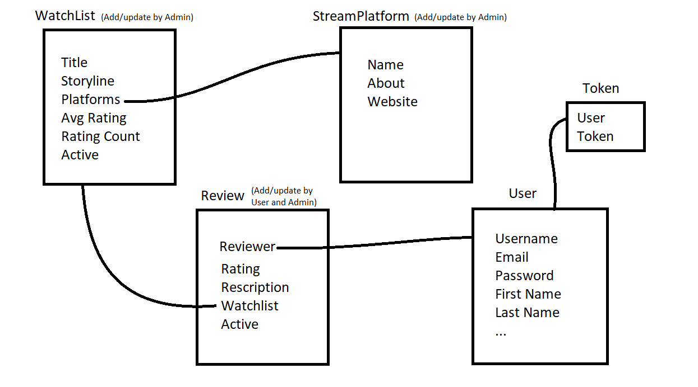
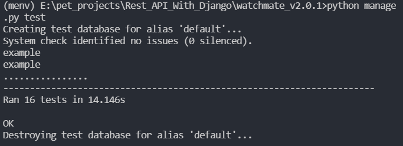

# Rest API With Django

## Description

This is a Restful API using Django and MySQL.
The purpose of the API is to let the users discover TV shows and movies and its streaming platform and serve ratings from other users and let users add rating. This API contains Token base authentication and user registration and login facilities. Some URLs are restricted to the admins and some to authenticated users. 

The watchmate_v1 is not a Restful api. This is just for learning normal Django.
The watchmate_v2 is a Restful api using Django which contains various practices of REST_FRAMEWORK.
The watchmate_v2.0.1 is an optimized and clean version of watchmate_v2

#### Concepts Learned:

1. API Basics

2. Serializers
- Serializers
- ModelSerializer
- HyperlinkedModelSerializer

3. Function-Based

4. Class-Based Views
- APIView
- Generic Views
- Mixins
- Concrete View Classes

5. Viewsets and Routers

6. Permissions
- IsAuthenticated
- IsAdminUser
- IsAuthenticatedOrReadOnly
- Custom Permission

7. Authentications
- BasicAuthentication
- TokenAuthentication
- JSON Web Token Authentication

8. Throttling
- AnonRateThrottle
- UserRateThrottle
- ScopedRateThrottle
- Custom Throttles

9. Django Filter Backend
- Filtering
- Searching
- Ordering

10. Pagination
- Page Number
- Limit Offset
- Cursor

11. Automated API Testing

12. Clean Coding Practice

**Django** is a high-level Python web framework that encourages rapid development and clean, pragmatic design. Built by experienced developers, it takes care of much of the hassle of web development, so you can focus on writing your app without needing to reinvent the wheel. It’s free and open source.
   
**MySQL** is free and open-source software under the terms of the GNU General Public License, and is also available under a variety of proprietary licenses. MySQL has stand-alone clients that allow users to interact directly with a MySQL database using SQL, but more often, MySQL is used with other programs to implement applications that need relational database capability.

---

## Pre-requisites
At least Python 3.6 installed. 
- [Installation guide on Windows](https://docs.python.org/3.6/using/windows.html)
- [Installation guide on Unix](https://docs.python.org/3.6/using/unix.html)
- [Installation guide on Macintosh](https://docs.python.org/3.6/using/mac.html)

---

## Getting Started

1. Clone the repository using:
    > git clone https://github.com/rroy11705/Rest_API_With_Django

2. It is suggested to use a virtual environment.
- To install virtualenv
    > pip install virtualenv
- To create a virtualenv
    > virtualenv env_name
- To activate virtualenv
    > source env_name/bin/activate (on linux or mac)
    > env_name\Scripts\activate (on windows)

3. Go to console, open cmd with the folder path and install dependencies from _requirements.txt_ file using:
    > pip install -r requirements.txt

4. Make Sure you have MySQL installed and running. 
   You can download MySQL from [MySQL Community Downloads](https://dev.mysql.com/downloads/). For this project we only need MySQL Server and MySQL Workbench.

5. Rename the _.envexample_ file to _.env_ and assign significant values to the environment variables

6. From console run the _run-app.py_ using:
    > python app.py

7. Use Postman to check the endpoints.

---

## Database Architecture 

---

## Endpoints for watchmate_v2

The Endpoints documentation is published in [postman](https://documenter.getpostman.com/view/7163762/UUy66k4d) and can be accessed publicly.

---

## Testing

The command for testing is:

> python manage.py test

on successful test it will show the following:

---

## LICENSE

[MIT License](https://github.com/rroy11705/Student-Management-System-Flask/blob/main/LICENSE)
Copyright (c) 2021 Rahul Roy